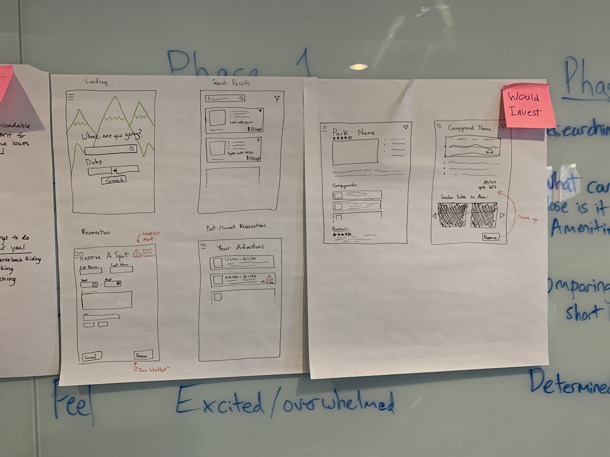

# Moondock — Educational Demo

**Moondock** is a full-stack campsite-search and trip-planning app built to
demonstrate AI-assisted design engineering. It is the companion codebase to the
[Resonance Lab AI Design Engineering field guide](campwatch-ui/design/AI_DESIGN_ENGINEERING.md).

---

## Why did a guy with a distaste for AI do this?
Once upon a time, shrtly after the dotcom bubble burst, I was at a DI conference during the, thankfully brief time period when I was doing data analytics. One guy was lamenting our web development demise over a beer and he told me a bright side version of our luck.

> "Change is the only renewable resource in tech. Tools are ephemeral. Thus, learn the tool, keep your job."

"Moondock," a personal utility I use for camping and hiking trips so I don't have to pay some service yet more of my cash. It's an artifact from my Cardinal Solutions Days as a purely UX exercise with a group of highly talented engineers - and I do have it running in my home lab now.

The actual purpose of this is to help my crew to understand how to use Agentic development (better) with design boundaries, test frameworks, regression safe guards, and mock API data plus documentation standards.

What follows is not design perfect, it's AI after all, but it does have my graybearded gnarled architect hands firmly steering this wheel.

Spoiler: If you are still delusional that Agentic AI will **quickly** and **cheaply** solve your problem, you are wrong. THis still takes (human) skill, time, a lot of back and forth, a shit ton of planning and more.

As always, think about the human first, then draft a sketch, talk to another human, and then start your planning.



## What's in here

| Layer | Stack | Directory |
|---|---|---|
| **Frontend** | React 19 · Vite · TypeScript · Tailwind v4 | `campwatch-ui/` |
| **REST API** | .NET 9 / ASP.NET Core · SQLite | `CampWatch.Api/` |
| **Infrastructure** | EF Core · Dapper | `CampWatch.Infrastructure/` |
| **Camply bridge** | Python · FastAPI · [camply CLI](https://github.com/juftin/camply) | `camply-bridge/` |
| **Orchestration** | Docker Compose | `docker-compose.yml` |

The five UI pages — **Search**, **Results**, **Trip History**, **Plan a Trip**,
and **Trip Log** — share a design system documented in `campwatch-ui/design/`.

---

## Running the demo

There are two ways to run Moondock, depending on what you want to explore.

---

### Option A — UI only with mock data (recommended for design demos)

No backend, no Docker. The browser intercepts all API calls via
[MSW (Mock Service Worker)](https://mswjs.io) and returns realistic fixture data.
This is the fastest way to see the full app.

#### Prerequisites

| Tool | Version | Install |
|---|---|---|
| Node.js | 20 LTS or 22 LTS | [nodejs.org](https://nodejs.org) or `brew install node` |
| npm | 10+ | Ships with Node |

> **macOS tip:** Install Node with [nvm](https://github.com/nvm-sh/nvm) so you can
> switch versions per-project:
> ```bash
> curl -o- https://raw.githubusercontent.com/nvm-sh/nvm/v0.39.7/install.sh | bash
> source ~/.zshrc          # or ~/.bashrc
> nvm install 22
> nvm use 22
> ```

#### Steps

```bash
# 1. Clone
git clone https://github.com/jeff-breece/moondock-educational-demo.git
cd moondock-educational-demo/campwatch-ui

# 2. Install dependencies
npm install

# 3. Enable mock API
cp .env.demo .env.local

# 4. Start dev server
npm run dev
```

Open **http://localhost:5173** in your browser. All API responses are mocked —
no network calls leave the browser.

The `.env.demo` file sets `VITE_MOCK_API=true`. To switch back to a real backend,
delete `.env.local` or set `VITE_MOCK_API=false`.

---

### Option B — Full stack with Docker Compose

Runs the complete system: React UI (nginx), .NET API, SQLite database, and the
camply Python bridge. Matches the production homelab topology.

#### Prerequisites

| Tool | Version | Install |
|---|---|---|
| Docker Desktop | 4.x+ | [docs.docker.com/desktop/install/mac-install](https://docs.docker.com/desktop/install/mac-install/) |
| Docker Compose | v2 (bundled with Desktop) | — |

> **Note:** Docker Desktop for Mac includes Compose v2 (`docker compose` not
> `docker-compose`). If you only have the old standalone binary, install Desktop.

#### Steps

```bash
# 1. Clone
git clone https://github.com/jeff-breece/moondock-educational-demo.git
cd moondock-educational-demo

# 2. Start all services
docker compose up --build

# Wait for all three containers to report "Started" (~60–90 s on first run)
```

Services and ports:

| Service | URL |
|---|---|
| **UI** (nginx, React) | http://localhost:3001 |
| **REST API** (.NET) | http://localhost:8080 |
| **Camply bridge** (Python) | http://localhost:8088 |

To stop:
```bash
docker compose down
```

To stop and wipe the SQLite database:
```bash
docker compose down -v
```

#### .NET toolchain (optional — for API development without Docker)

If you want to run the API natively instead of in a container:

```bash
# Install .NET 9 SDK
brew install --cask dotnet-sdk   # or download from https://dotnet.microsoft.com

# Restore and run
cd CampWatch.Api
dotnet restore
dotnet run
# API listens on http://localhost:8080
```

#### Python bridge (optional — for real campsite search)

The camply bridge requires the [camply CLI](https://github.com/juftin/camply)
and valid Recreation.gov / state-park credentials. It is **not needed** for
Option A (mock mode).

```bash
cd camply-bridge
python3 -m venv venv
source venv/bin/activate
pip install -r requirements.txt
uvicorn app:app --port 8088
```

---

## Running tests

### Unit tests (Vitest + React Testing Library)

```bash
cd campwatch-ui
npm test           # watch mode
npm test -- --run  # single pass (CI)
npm run test:coverage
```

### End-to-end tests (Playwright)

Playwright tests run against a live URL. Use Option A or B above to start
the app first, then:

```bash
cd campwatch-ui

# Install Playwright browsers (first time only — ~200 MB download)
npx playwright install

# Run against local dev server (Option A)
BASE_URL=http://localhost:5173 npm run test:e2e

# Run against Docker stack (Option B)
BASE_URL=http://localhost:3001 npm run test:e2e

# Open the interactive Playwright UI (great for debugging)
BASE_URL=http://localhost:5173 npm run test:e2e:ui
```

Playwright runs two browser projects by default: **Desktop Chrome** and
**iPhone 13 (mobile)**. Reports land in `playwright-report/`; screenshots and
traces on failure in `test-results/`.

---

## Project structure

```
moondock-educational-demo/
│
├── campwatch-ui/                   ← React frontend
│   ├── design/                     ← Design artifact library ★
│   │   ├── AI_DESIGN_ENGINEERING.md   ← How-to guide (start here)
│   │   ├── STYLE_GUIDE.md
│   │   ├── COMPONENT_LIBRARY.md
│   │   ├── PAGE_AUDIT.md
│   │   └── LAYOUT_SPEC.md
│   ├── src/
│   │   ├── components/             ← Shared UI components
│   │   ├── pages/                  ← 5 feature pages
│   │   ├── mocks/                  ← MSW mock layer ★
│   │   │   ├── browser.ts          ← MSW browser integration
│   │   │   ├── handlers.ts         ← Request handlers for all endpoints
│   │   │   └── data.ts             ← Fixture data (trips, sites, outings)
│   │   ├── hooks/
│   │   ├── types/
│   │   └── utils/
│   ├── e2e/                        ← Playwright E2E specs
│   │   ├── navigation.spec.ts
│   │   ├── search.spec.ts
│   │   ├── results.spec.ts
│   │   ├── reserve.spec.ts
│   │   └── history-log.spec.ts
│   ├── src/__tests__/              ← Vitest unit specs (40 tests)
│   ├── .env.demo                   ← Copy to .env.local for mock mode
│   └── playwright.config.ts
│
├── CampWatch.Api/                  ← .NET 9 REST API
├── CampWatch.Infrastructure/       ← EF Core + SQLite
├── CampWatch.Tests/                ← .NET xUnit tests
├── camply-bridge/                  ← Python / camply CLI bridge
└── docker-compose.yml
```

★ = start here for the design engineering walkthrough

---

## The design system

All design decisions are documented in `campwatch-ui/design/`. If you're here
to learn the AI-assisted workflow, read the files in this order:

1. **`AI_DESIGN_ENGINEERING.md`** — the complete field guide: how to use an AI
   agent as a design-engineering partner, illustrated by this codebase's actual
   refactoring history. Covers prompt anatomy, the feedback loop, Playwright
   layout tests, and Vitest unit guards.

2. **`STYLE_GUIDE.md`** — design tokens, color system, typography, spacing.

3. **`COMPONENT_LIBRARY.md`** — every component with props, usage, and known issues.

4. **`LAYOUT_SPEC.md`** — the PageShell layout system, optical centering, the
   topbar/nav-drawer stack, and responsive breakpoints.

5. **`PAGE_AUDIT.md`** — the original UX audit (P1/P2/P3) that drove the
   refactoring, with resolution notes.

---

## Mock data reference

When running in mock mode (`VITE_MOCK_API=true`) the following data is pre-loaded:

| Resource | Count | Details |
|---|---|---|
| Trips | 4 | 2 Planned, 1 Completed, 1 Cancelled; mix of providers |
| Outings / log entries | 3 | 2 linked to the Salt Fork trip, 1 standalone day hike |
| Campsite results | 6 | Ohio State Parks + Recreation.gov; various site types |
| Campground seeds | ~16 | Across all 4 providers for the picker autocomplete |

POST/PUT/DELETE operations update an in-memory store so state changes feel
live within a browser session. Refreshing the page resets to the default fixtures.

---

## Troubleshooting

### "mockServiceWorker.js not found" in the browser console

The service worker file must be in the `public/` directory. If it's missing:
```bash
cd campwatch-ui
npx msw init public/ --save
```

### Port 5173 already in use

```bash
npm run dev -- --port 5174
```

### Playwright can't find browsers

```bash
cd campwatch-ui
npx playwright install --with-deps chromium
```

### Docker: "port already allocated"

Another process is using 3001, 8080, or 8088. Find and stop it:
```bash
lsof -i :3001   # then kill <PID>
```

Or change the host port in `docker-compose.yml`:
```yaml
ports:
  - "3002:80"   # change 3001 to any free port
```

---

## License

MIT — use freely for learning and portfolio purposes.

---

*Built with [Resonance Lab](https://github.com/jeff-breece/resonance-lab).
Design methodology documented in [`campwatch-ui/design/AI_DESIGN_ENGINEERING.md`](campwatch-ui/design/AI_DESIGN_ENGINEERING.md).*
